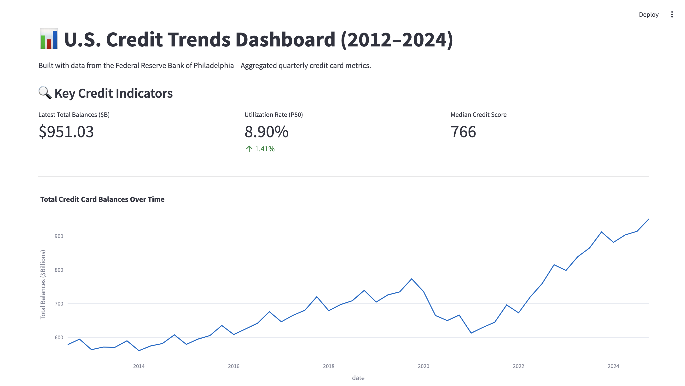

# US Credit Card Trends Dashboard (2012–2024)

📊 **Interactive Dashboard built with Streamlit + Plotly**  
Analyzing the evolution of consumer credit card behavior in the United States using data from the Federal Reserve Bank of Philadelphia.

---

## 🔍 Project Objective

This project provides an interactive visual analysis of quarterly aggregated credit card data from 2012 to 2024.  
The dashboard aims to help analysts, banks, or policymakers monitor:

- Credit balances and debt evolution  
- Credit utilization trends (P50, P75, P90)  
- Median credit scores  
- Payment behavior (full vs partial vs minimum payments)  
- Delinquency trends (30+, 60+, 90+ days)

---

## 📊 Data Source

- **Source**: [Federal Reserve Bank of Philadelphia – Credit Card Data](https://www.philadelphiafed.org/surveys-and-data/large-bank-credit-card-and-mortgage-data)
- Dataset used: **Credit Card Balances – Q4 2024**
- Type: **Aggregated data** (public, no individual-level data)

---

## ⚙️ Technologies Used

| Tool         | Purpose                          |
|--------------|----------------------------------|
| Python       | Data processing                  |
| Pandas       | Data cleaning & manipulation     |
| Streamlit    | Dashboard development            |
| Plotly       | Interactive visualizations       |
| VS Code      | Development environment          |

---

## 🚀 How to Run the Dashboard Locally

1. Clone this repository  
2. Install the required packages:

```bash
pip install streamlit pandas plotly
```

3. Launch the app:

```bash
streamlit run app/simulateur.py
```

---

## 🧠 Key Insights

* Total credit card balances reached **\$951B in Q4 2024**, a historical high.
* Median credit scores remained stable around **760**.
* Credit utilization at the 90th percentile exceeds **90%**, indicating rising risk exposure.
* The share of minimum payments is increasing, possibly reflecting cash flow stress.
* Delinquency rates (especially 90+ days) slightly increased from 2023 to 2024.

---

## 📸 Dashboard Preview



Link to the dashboard: https://credit-scoring-federal-reserve-dashboard.streamlit.app/
---

## 🧾 Author

**Esméralda Nguetse**
Data Analyst & Aspiring Data Scientist
🌐 [dynamic-daifuku-063eb6.netlify.app](dynamic-daifuku-063eb6.netlify.app)

---

## 🪪 License

This project is intended for educational and professional demonstration purposes.
Source data © Federal Reserve Bank of Philadelphia.
